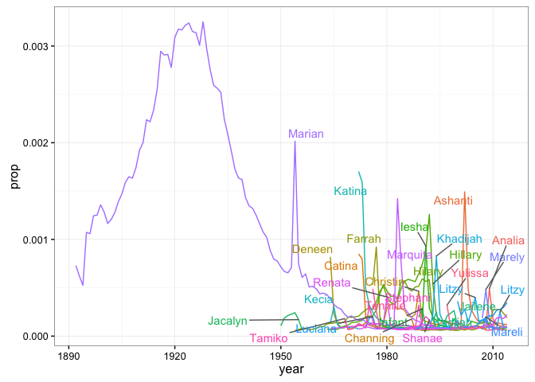
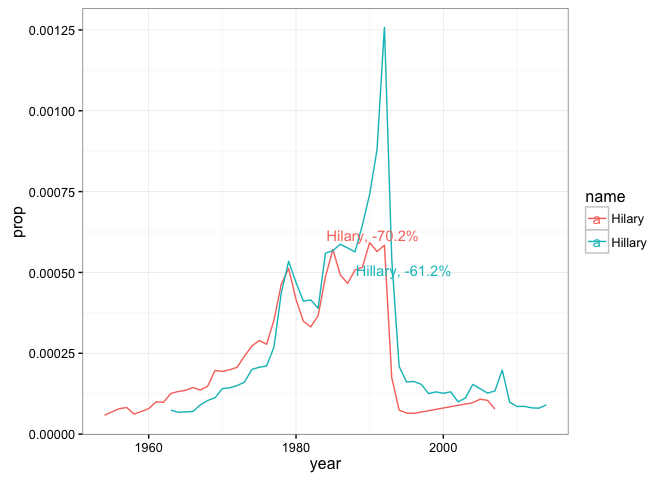

``` r
library(babynames)
library(dplyr)
```

    ## 
    ## Attaching package: 'dplyr'

    ## The following objects are masked from 'package:stats':
    ## 
    ##     filter, lag

    ## The following objects are masked from 'package:base':
    ## 
    ##     intersect, setdiff, setequal, union

``` r
library(ggplot2)
library(ggrepel)
babynames %>% summarize(max(year))
```

    ## # A tibble: 1 × 1
    ##   `max(year)`
    ##         <dbl>
    ## 1        2014

``` r
babynames %>% 
  filter(sex == "F",  n >= 115) %>% 
  rename(n_babies = n) %>% 
  arrange(name, year) 
```

    ## # A tibble: 115,436 × 5
    ##     year   sex    name n_babies         prop
    ##    <dbl> <chr>   <chr>    <int>        <dbl>
    ## 1   2013     F  Aadhya      172 8.965010e-05
    ## 2   2014     F  Aadhya      249 1.284476e-04
    ## 3   2014     F   Aadya      164 8.460001e-05
    ## 4   2013     F Aaleyah      116 6.046170e-05
    ## 5   1994     F Aaliyah     1451 7.445779e-04
    ## 6   1995     F Aaliyah     1254 6.528030e-04
    ## 7   1996     F Aaliyah      831 4.335921e-04
    ## 8   1997     F Aaliyah     1738 9.107105e-04
    ## 9   1998     F Aaliyah     1399 7.220496e-04
    ## 10  1999     F Aaliyah     1088 5.591907e-04
    ## # ... with 115,426 more rows

``` r
babynames %>% 
  filter(sex == "F",  n >= 115) %>% 
  rename(n_babies = n) %>% 
  arrange(name, year) %>% 
  group_by(name) %>% 
  mutate(yeardiff = c(NA, diff(year, lag = 1)),
         YoY_increase = 100*((prop / lag(prop, 1)) - 1),
         year_before = lag(year, 1), prop_before = lag(prop, 1))
```

    ## Source: local data frame [115,436 x 9]
    ## Groups: name [4,076]
    ## 
    ##     year   sex    name n_babies         prop yeardiff YoY_increase
    ##    <dbl> <chr>   <chr>    <int>        <dbl>    <dbl>        <dbl>
    ## 1   2013     F  Aadhya      172 8.965010e-05       NA           NA
    ## 2   2014     F  Aadhya      249 1.284476e-04        1     43.27655
    ## 3   2014     F   Aadya      164 8.460001e-05       NA           NA
    ## 4   2013     F Aaleyah      116 6.046170e-05       NA           NA
    ## 5   1994     F Aaliyah     1451 7.445779e-04       NA           NA
    ## 6   1995     F Aaliyah     1254 6.528030e-04        1    -12.32577
    ## 7   1996     F Aaliyah      831 4.335921e-04        1    -33.57995
    ## 8   1997     F Aaliyah     1738 9.107105e-04        1    110.03856
    ## 9   1998     F Aaliyah     1399 7.220496e-04        1    -20.71580
    ## 10  1999     F Aaliyah     1088 5.591907e-04        1    -22.55509
    ## # ... with 115,426 more rows, and 2 more variables: year_before <dbl>,
    ## #   prop_before <dbl>

``` r
YoY_names <- babynames %>% 
  filter(sex == "F",  n >= 115) %>% 
  rename(n_babies = n) %>% 
  arrange(name, year) %>% 
  group_by(name) %>% 
  mutate(yeardiff = c(NA, diff(year)),
         YoY_increase = 100*((prop / lag(prop, 1)) - 1),
         year_before = lag(year, 1), prop_before = lag(prop, 1)) %>% 
  ungroup() %>% 
  filter(!is.na(YoY_increase), yeardiff == 1) %>% 
  arrange(YoY_increase)
YoY_names
```

    ## # A tibble: 108,528 × 9
    ##     year   sex     name n_babies         prop yeardiff YoY_increase
    ##    <dbl> <chr>    <chr>    <int>        <dbl>    <dbl>        <dbl>
    ## 1   1978     F   Farrah      332 2.019914e-04        1    -78.08493
    ## 2   1995     F  Kadijah      119 6.194861e-05        1    -75.15995
    ## 3   1974     F   Catina      328 2.094373e-04        1    -73.68934
    ## 4   1990     F Stephani      173 8.424268e-05        1    -73.61845
    ## 5   1995     F Khadijah      438 2.280125e-04        1    -72.48665
    ## 6   1965     F   Deneen      421 2.303977e-04        1    -71.88849
    ## 7   1993     F   Hilary      343 1.740336e-04        1    -70.21517
    ## 8   1974     F   Katina      765 4.884742e-04        1    -69.30519
    ## 9   1981     F   Renata      224 1.252889e-04        1    -69.02427
    ## 10  1992     F    Iesha      581 2.899060e-04        1    -68.91587
    ## # ... with 108,518 more rows, and 2 more variables: year_before <dbl>,
    ## #   prop_before <dbl>

``` r
poisoned_names <- YoY_names %>% 
  filter(min_rank(YoY_increase) <= 30) %>% 
  select(name, year, prop, YoY_increase, year_before, prop_before)
poisoned_names
```

    ## # A tibble: 30 × 6
    ##        name  year         prop YoY_increase year_before  prop_before
    ##       <chr> <dbl>        <dbl>        <dbl>       <dbl>        <dbl>
    ## 1    Farrah  1978 2.019914e-04    -78.08493        1977 0.0009217010
    ## 2   Kadijah  1995 6.194861e-05    -75.15995        1994 0.0002493900
    ## 3    Catina  1974 2.094373e-04    -73.68934        1973 0.0007960170
    ## 4  Stephani  1990 8.424268e-05    -73.61845        1989 0.0003193242
    ## 5  Khadijah  1995 2.280125e-04    -72.48665        1994 0.0008287342
    ## 6    Deneen  1965 2.303977e-04    -71.88849        1964 0.0008195850
    ## 7    Hilary  1993 1.740336e-04    -70.21517        1992 0.0005843028
    ## 8    Katina  1974 4.884742e-04    -69.30519        1973 0.0015913904
    ## 9    Renata  1981 1.252889e-04    -69.02427        1980 0.0004044744
    ## 10    Iesha  1992 2.899060e-04    -68.91587        1991 0.0009326495
    ## # ... with 20 more rows

``` r
babynames %>% 
  filter(sex == "F",  n >= 115) %>% 
  inner_join(poisoned_names %>% select(name), by = "name") %>% 
  ggplot(aes(x = year, y = prop, color = name)) +
    geom_line() +
    theme_bw() + theme(legend.position="none") +
    geom_text_repel(aes(x = year_before, y = prop_before, label = name), data = poisoned_names) 
```



``` r
trend_names <- babynames %>% 
  filter(sex == "F", n >= 115) %>% 
  left_join(YoY_names) %>% 
  arrange(YoY_increase) %>% 
  inner_join(poisoned_names %>% select(name)) %>% 
  group_by(name) %>% 
  mutate(max_YoY = max(YoY_increase, na.rm = TRUE),
         min_YoY = min(YoY_increase, na.rm = TRUE),
         year_rank = min_rank(year)) %>% 
  filter(max_YoY >= 100 | 
           (YoY_increase == min_YoY & year_rank %in% 2:10))  
```

    ## Joining, by = c("year", "sex", "name", "prop")

    ## Joining, by = "name"

``` r
trend_names
```

    ## Source: local data frame [397 x 13]
    ## Groups: name [27]
    ## 
    ##     year   sex     name     n         prop n_babies yeardiff YoY_increase
    ##    <dbl> <chr>    <chr> <int>        <dbl>    <int>    <dbl>        <dbl>
    ## 1   1978     F   Farrah   332 2.019914e-04      332        1    -78.08493
    ## 2   1995     F  Kadijah   119 6.194861e-05      119        1    -75.15995
    ## 3   1974     F   Catina   328 2.094373e-04      328        1    -73.68934
    ## 4   1990     F Stephani   173 8.424268e-05      173        1    -73.61845
    ## 5   1995     F Khadijah   438 2.280125e-04      438        1    -72.48665
    ## 6   1965     F   Deneen   421 2.303977e-04      421        1    -71.88849
    ## 7   1974     F   Katina   765 4.884742e-04      765        1    -69.30519
    ## 8   1981     F   Renata   224 1.252889e-04      224        1    -69.02427
    ## 9   1992     F    Iesha   581 2.899060e-04      581        1    -68.91587
    ## 10  1998     F  Yulissa   197 1.016753e-04      197        1    -68.29458
    ## # ... with 387 more rows, and 5 more variables: year_before <dbl>,
    ## #   prop_before <dbl>, max_YoY <dbl>, min_YoY <dbl>, year_rank <int>

``` r
babynames %>% 
  filter(sex == "F",  n >= 115) %>% 
  inner_join(poisoned_names %>% select(name), by = "name") %>% 
  anti_join(trend_names %>% select(name)) %>% 
  ggplot(aes(x = year, y = prop, color = name)) +
    geom_line() +
    geom_text_repel(aes(x = year_before, y = prop_before, label = paste0(name, ", ", round(YoY_increase, 1), "%")), data = poisoned_names %>% filter(name %in% c("Hilary", "Hillary"))) +
    theme_bw()
```

    ## Joining, by = "name"


