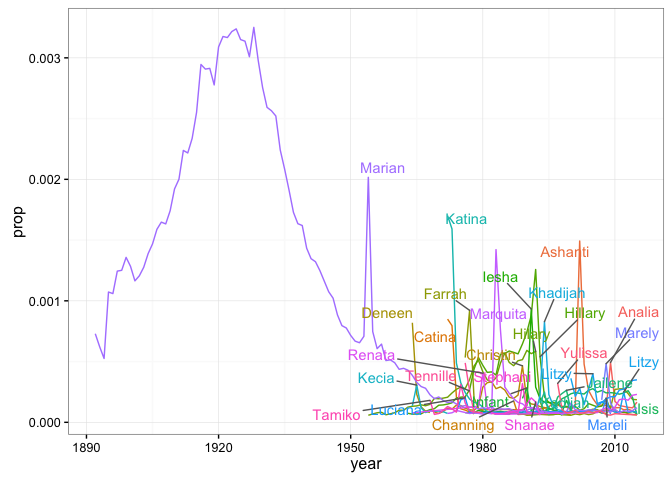
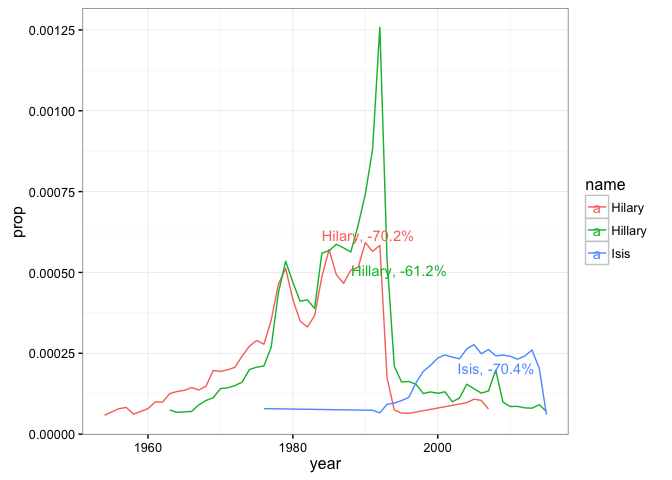

``` r
library(dplyr)
```

    ## 
    ## Attaching package: 'dplyr'

    ## The following objects are masked from 'package:stats':
    ## 
    ##     filter, lag

    ## The following objects are masked from 'package:base':
    ## 
    ##     intersect, setdiff, setequal, union

``` r
library(ggplot2)
library(readr)
library(ggrepel)

babynames <- read_csv('https://cdn.rawgit.com/wharton-data-analytics/babynames/3192856738dee4a91bfc7d320355daa5ae428c17/data-raw/csv/babynames.csv')
```

    ## Parsed with column specification:
    ## cols(
    ##   year = col_double(),
    ##   sex = col_character(),
    ##   name = col_character(),
    ##   n = col_integer(),
    ##   prop = col_double()
    ## )

``` r
babynames %>% summarize(max(year))
```

    ## # A tibble: 1 × 1
    ##   `max(year)`
    ##         <dbl>
    ## 1        2015

``` r
YoY_names <- babynames %>% 
  filter(sex == "F",  n >= 115) %>% 
  rename(n_babies = n) %>% 
  arrange(name, year) %>% 
  group_by(name) %>% 
  mutate(yeardiff = c(NA, diff(year)),
         YoY_increase = 100*((prop / lag(prop, 1)) - 1),
         year_before = lag(year, 1), prop_before = lag(prop, 1)) %>% 
  ungroup() %>% 
  filter(!is.na(YoY_increase), yeardiff == 1) %>% 
  arrange(YoY_increase)
```

``` r
poisoned_names <- YoY_names %>% 
  filter(min_rank(YoY_increase) <= 30) %>% 
  select(name, year, prop, YoY_increase, year_before, prop_before)
```

``` r
babynames %>% 
  filter(sex == "F",  n >= 115) %>% 
  inner_join(poisoned_names %>% select(name), by = "name") %>% 
  ggplot(aes(x = year, y = prop, color = name)) +
    geom_line() +
    theme_bw() + theme(legend.position="none") +
    geom_text_repel(aes(x = year_before, y = prop_before, label = name), data = poisoned_names) 
```



``` r
trend_names <- babynames %>% 
  filter(sex == "F", n >= 115) %>% 
  left_join(YoY_names) %>% 
  arrange(YoY_increase) %>% 
  inner_join(poisoned_names %>% select(name)) %>% 
  group_by(name) %>% 
  mutate(max_YoY = max(YoY_increase, na.rm = TRUE),
         min_YoY = min(YoY_increase, na.rm = TRUE),
         year_rank = min_rank(year)) %>% 
  filter(max_YoY >= 100 | 
           (YoY_increase == min_YoY & year_rank %in% 2:10))  
```

    ## Joining, by = c("year", "sex", "name", "prop")

    ## Joining, by = "name"

``` r
babynames %>% 
  filter(sex == "F",  n >= 115) %>% 
  inner_join(poisoned_names %>% select(name), by = "name") %>% 
  anti_join(trend_names %>% select(name)) %>% 
  ggplot(aes(x = year, y = prop, color = name)) +
    geom_line() +
    geom_text_repel(aes(x = year_before, y = prop_before, label = paste0(name, ", ", round(YoY_increase, 1), "%")), data = poisoned_names %>% filter(name %in% c("Hilary", "Hillary", "Isis"))) +
    theme_bw()
```

    ## Joining, by = "name"


